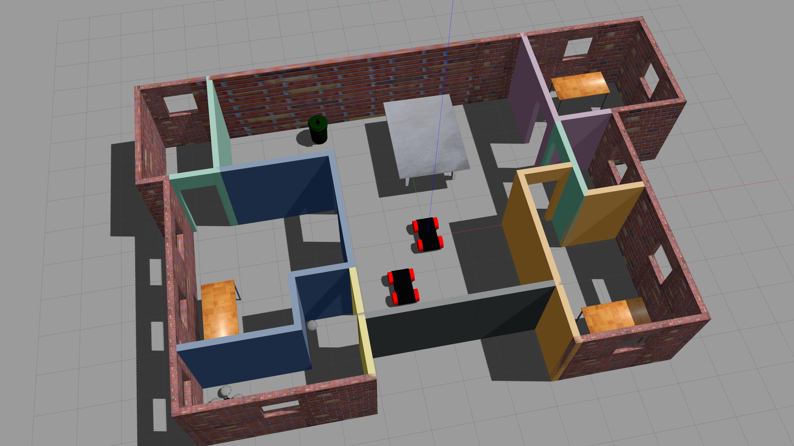

# Build My World

[](http://www.udacity.com/robotics)



## Overview

This project is to build a world in Gazebo for the future projects. The world is an apartment containing two humanoid robots and other furnitures.

## Build Instruction

To build the scripts

```
$ mkdir build
$ cd build/
$ cmake ../
$ make
```

Change path variables to allow Gazebo to use the scripts

`$ export GAZEBO_PLUGIN_PATH=${GAZEBO_PLUGIN_PATH}:/home/workspace/P1-Build-My-World/build`

Launch the world file and scripts in Gazebo

```
$ cd /home/workspace/P1-Build-My-World/world/
$ gazebo apartment.world
```

If anything failed, try to launch the world with `--verbose` to check the error:

`$ gazebo apartment.world --verbose`

## Directory Structure

```
P1-Build-My-World                  # Build My World Project 
├── model                          # Model files 
│   ├── Building
│   │   ├── model.config
│   │   ├── model.sdf
│   ├── VehicleRobot
│   │   ├── model.config
│   │   ├── model.sdf
├── script                         # Gazebo World plugin C++ script      
│   ├── welcome_message.cpp
├── world                          # Gazebo main World containing models 
│   ├── apartment.world
├── demonstration                  # Demonstrate file for README 
│   ├── world.png
├── CMakeLists.txt                 # Link libraries 
└── README.md                      # Readme file                             
```