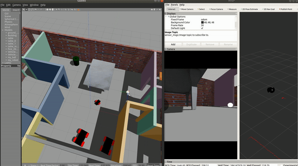

# Go Chase It

[](http://www.udacity.com/robotics)

## Result Demonstration 

### Video demonstration

 [](https://youtu.be/9KsvwoPLz4o)

## Overview

This project is to build a two-wheel robot with camera and laser set up. The goal is to chase a white ball captured by the camera and avoid hitting obstacles in the environment. The world used is the same one built in the first project.

## Build Instruction

To build the scripts

```
$ cd home/catkin_ws
$ catkin_make
```

Launch the world file and scripts in Gazebo

```
$ roslaunch my_robot world.launch
$ roslaunch ball_chaser ball_chaser.launch
```

Move the white ball so that the robot can see it. The robot will automatically follow the ball.

## Directory Structure

```
P2-Go-Chase-It                     # Go Chase It Project
├── my_robot                       # my_robot package                   
│   ├── launch                     # launch folder for launch files   
│   │   ├── robot_description.launch
│   │   ├── world.launch
│   ├── meshes                     # meshes folder for sensors
│   │   ├── hokuyo.dae
│   ├── urdf                       # urdf folder for xarco files
│   │   ├── my_robot.gazebo
│   │   ├── my_robot.xacro
|   |   ├── materials.xacro
│   ├── world                      # world folder for world files
│   │   ├── apartment.world
│   ├── CMakeLists.txt             # compiler instructions
│   ├── package.xml                # package info
├── ball_chaser                    # ball_chaser package                   
│   ├── launch                     # launch folder for launch files   
│   │   ├── ball_chaser.launch
│   ├── src                        # source folder for C++ scripts
│   │   ├── drive_bot.cpp
│   │   ├── process_images.cpp
│   ├── srv                        # service folder for ROS services
│   │   ├── DriveToTarget.srv
│   ├── CMakeLists.txt             # compiler instructions
│   ├── package.xml                # package info  
├── demonstration                  # Demonstrate file for README 
│   ├── p2.gif
└── README.md                      # Readme file                                          
```