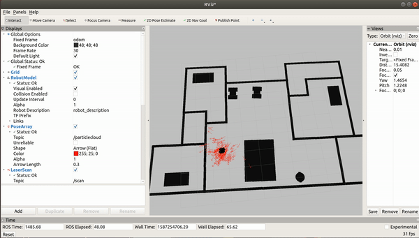

# Where Am I

[](http://www.udacity.com/robotics)

## Result Demonstration 

### Video demonstration

 [](https://youtu.be/xvVt7t_Lbuo)

## Overview

This project is to localize a robot in an environment using Monte Carlo Localization (MCL), also known as particle filter. The project used [pgm_map_creator](https://github.com/hyfan1116/pgm_map_creator) to create a map from gazebo world, and then localize the robot with [amcl](http://wiki.ros.org/amcl#Parameters) provided by ROS.

## Run Instruction

To build the scripts

```
$ cd home/catkin_ws
$ catkin_make
```

Launch the world file and scripts in Gazebo

```
$ roslaunch mcl_robot world.launch
$ roslaunch mcl_robot amcl.launch
```

In Rviz, you could move and localize the robot in two methods.

**Option I**: Using navigation tool from Rviz. Click the `2D Nav Goal` button and then click a location in the map. The robot should be able to navigate to the desired location.

**Option I**: Using `teleop` node to manually control the vehicle. Run

`rosrun teleop_twist_keyboard teleop_twist_keyboard.py`.

One could control the vehicle following the instruction.

## Directory Structure

```
P3-Where-Am-I                      # Where am I Project
├── mcl_robot                      # my_robot package                   
│   ├── launch                     # launch folder for launch files   
│   │   ├── robot_description.launch
│   │   ├── world.launch
│   │   ├── amcl.launch
│   ├── meshes                     # meshes folder for sensors
│   │   ├── hokuyo.dae
│   ├── urdf                       # urdf folder for xarco files
│   │   ├── my_robot.gazebo
│   │   ├── my_robot.xacro
|   |   ├── materials.xacro
│   ├── world                      # world folder for world files
│   │   ├── apartment.world
│   ├── maps                       # maps of the world
│   │   ├── apartment.pgm
│   │   ├── apartment.yaml
│   ├── configs                    # navigation configurations
│   │   ├── ...
│   ├── CMakeLists.txt             # compiler instructions
│   ├── package.xml                # package info 
├── demonstration                  # Demonstrate file for README 
│   ├── p3.gif
└── README.md                      # Readme file                                          
```