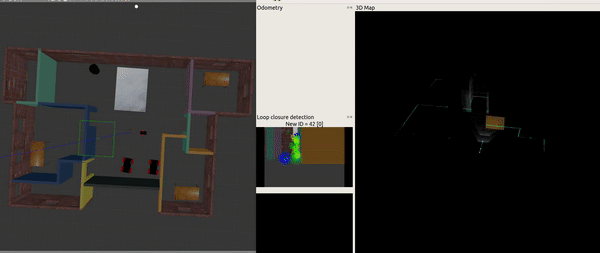
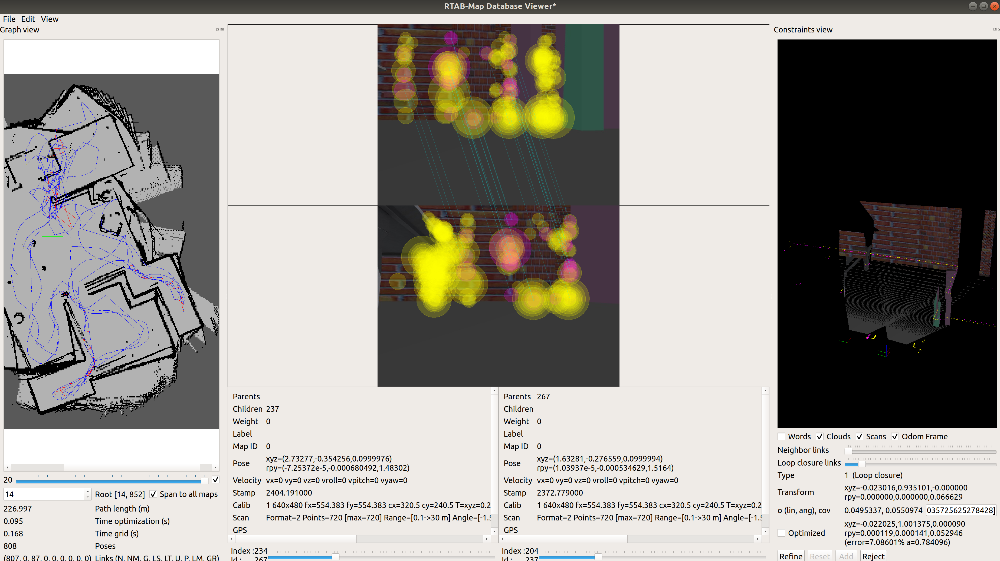

# Where Am I

[](http://www.udacity.com/robotics)

## Result Demonstration 

### Video demonstration

 [](https://youtu.be/)

## OverviewSLAM

This project created a 2D occupancy grid and 3D octomap from the apartment environment using the built robot with the [RTAB-Map](http://wiki.ros.org/rtabmap_ros) package. The robot had to move a few rounds around the environment in order to properly portray the environment. After creating the map, a `db` file was saved in the launch folder originally and was moved to the maps folder for future use.



## Run Instruction

To build the scripts

```
$ cd home/catkin_ws
$ catkin_make
```

Launch the world, the robot and the slam module in gazebo

```
$ roslaunch slam_robot world.launch
$ roslaunch slam_robot teleop.launch
$ roslaunch slam_robot mapping.launch
```

## Directory Structure

```
P4-Map-My-World                    # Map My World Project
├── slam_robot                     # slam_robot package                   
│   ├── launch                     # launch folder for launch files   
│   │   ├── robot_description.launch
│   │   ├── world.launch
│   │   ├── teleop.launch
│   │   ├── mapping.launch
│   │   ├── mapping_with_visualization.launch
│   │   ├── localization.launch
│   ├── meshes                     # meshes folder for sensors
│   │   ├── hokuyo.dae
│   ├── urdf                       # urdf folder for xarco files
│   │   ├── my_robot.gazebo
│   │   ├── my_robot.xacro
|   |   ├── materials.xacro
│   ├── worlds                     # world folder for world files
│   │   ├── apartment.world
│   │   ├── apartment.rviz
│   ├── maps                       # maps created after salm
│   │   ├── apartment.db
│   ├── CMakeLists.txt             # compiler instructions
│   ├── package.xml                # package info 
├── demonstration                  # Demonstrate file for README 
│   ├── p4.gif
│   ├── slam.png
└── README.md                      # Readme file                                          
```