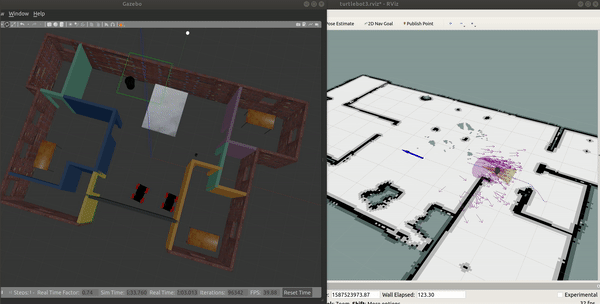

# Home Service Robot

[](http://www.udacity.com/robotics)

## Result Demonstration 

### Video demonstration

 [](https://youtu.be/-6iFxDoOUwM)

## Overview

This project is to 

Platform:
Ubuntu 18 + ROS melodic

## Run Instruction
Prerequisite
Install packages [Gmapping](http://wiki.ros.org/gmapping), [turtlebot3](http://wiki.ros.org/turtlebot3?distro=melodic).

To build the scripts

```
$ cd home/catkin_ws
$ catkin_make
```

Launch the world file and scripts in Gazebo

```
$ roslaunch mcl_robot world.launch
$ roslaunch mcl_robot amcl.launch
```

## Directory Structure

```
# Official ROS packages
|
amcl                                # localization and navigation
├── ...
slam_gmapping               		# slam                
├── gmapping
├── ...
turtlebot3                     		# turtlebot 3
├── turtlebot_teleop                # keyboard_teleop file
├── turtlebot_description           # turtlebot3 urdf
├── ...
|
|
P5-Home-Service-Robot     		    # This package
├── scripts                   		# shell scripts files
|   ├── home_service.sh
|   ├── add_marker.sh
|   ├── pick_objects.sh
|   ├── test_slam.sh
|   ├── test_navigation.sh
├── turtlebot3_command              # home service code
│   ├── launch                      # launch file
│   |   ├── turtlebot3_command.launch
|   ├── src
│   |   ├── pick_objects.cpp
│   |   ├── add_markers.cpp
│   ├── CMakeLists.txt
│   ├── package.xml
├── turtlebot3_world                # turtlebot3 world
│   ├── rvizConfig                  # Rviz config
│   |   ├── turtlebot.rviz
│   ├── worlds                      # World urdf
│   |   ├── apartment.world
│   ├── launch                      # World launch
│   |   ├── turtlebot3_world.launch
│   ├── CMakeLists.txt
│   ├── package.xml
├── demonstration             		# Demonstrate file for README 
├── ├── p5.gif
└── README.md                  		# Readme file                                          
```

