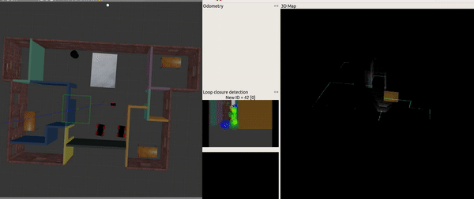

# Robotics Software Engineer

*Udacity Robotics Software Engineer Nano Degree projects.*

## Finished projects:
- 1, Build My World
- 2, Go Chase It
- 3, Where Am I
- 4, Map My World
- 5, Home Service Robot

## Demonstration

### 1. [Build My World](https://github.com/joeyzhong90595/Robotics-Software-Engineer-Projects/tree/master/P1-Build-My-World)
Built an apartment and generate two mobile robots in gazebo.

#### Image demonstration:

  		

### 2. [Go Chase It](https://github.com/joeyzhong90595/Robotics-Software-Engineer-Projects/tree/master/P2-Go-Chase-It)

A two-wheel robot is built with laser and camera set up. The robot managed to chase a white ball in the environment built above.

#### Video demonstration:

    

### 3. [Where Am I](https://github.com/joeyzhong90595/Robotics-Software-Engineer-Projects/tree/master/P3-Where-Am-I)

A two-wheel robot is built with laser and camera set up. The robot tried to localize itself in the apartment with Monte Carlo Localization (MCL) algorithm, also known as particle filter.

#### Video demonstration:

    

### 4. [Map My World](https://github.com/joeyzhong90595/Robotics-Software-Engineer-Projects/tree/master/P4-Map-My-World)

#### Video demonstration:

    

### 5. [Home Service Robot](https://github.com/joeyzhong90595/Robotics-Software-Engineer-Projects/tree/master/P5-Home-Service-Robot)

Combining all the modules mention above, this project map the apartment, localize itself in the environment, plan trajectories and navigate to the desired goals to achieve a pick & drop task.

#### Video demonstration:

    

